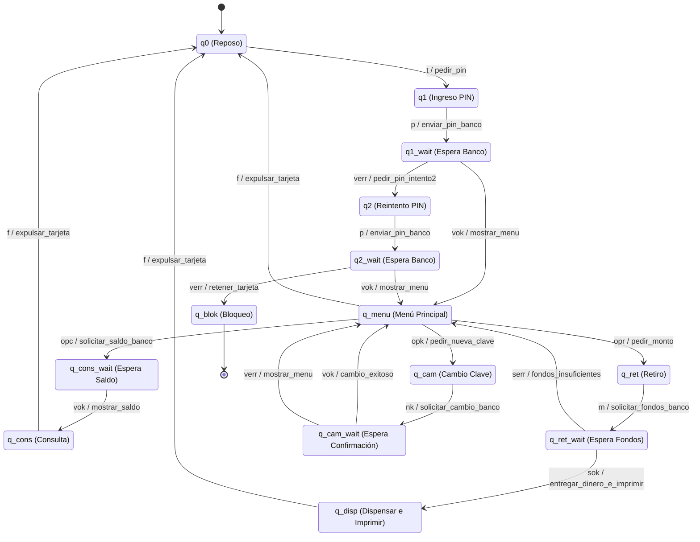
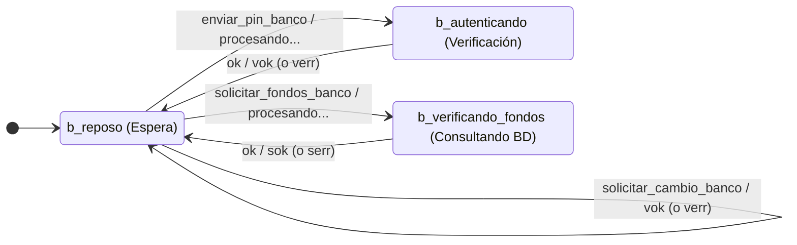

# Autómata de Control Interoperable para Cajero Automático

**Universidad:** Universidad de Los Andes (ULA) - Facultad de Ingeniería  
**Escuela:** Escuela de Ingeniería de Sistemas  
**Materia:** Teoría de la Computación (Semestre A 2026)  
**Integrantes:** Ramón Belandria y Eugenia Ramirez  

---

## 1. Descripción del Proyecto

Este proyecto implementa el sistema de control de un cajero automático operando como un elemento de borde en una red bancaria. El objetivo principal es establecer un protocolo de intercambio de mensajes entre el cajero (cliente) y el sistema central del banco (servidor), garantizando funciones críticas como retiro de efectivo, consulta de saldo y cambio de clave de seguridad.

El sistema ha sido validado mediante la composición síncrona de autómatas, asegurando un diseño libre de interbloqueos lógicos y con manejo estricto de casos de borde.

## 2. Abstracción Matemática: Máquinas de Mealy

Dado que el cajero es un sistema reactivo que requiere emitir mensajes a la red en tiempo real, el uso de un Autómata Finito Determinístico (AFD) clásico es insuficiente. La arquitectura se fundamenta en **Máquinas de Mealy**, donde cada transición no solo altera el estado del sistema, sino que genera una salida explícita.

### 2.1. Definición Formal del Cajero (Cliente)
El transductor local se define como la tupla de 6 elementos $M_c = (Q_c, \Sigma_c, \Gamma_c, \delta_c, \lambda_c, q_0)$:

*   **$Q_c$ (Estados):** $\{q0, q1, q1\_wait, q2, q2\_wait, q\_menu, q\_cons\_wait, q\_cons, q\_ret, q\_ret\_wait, q\_disp, q\_cam, q\_cam\_wait, q\_blok\}$
*   **$\Sigma_c$ (Alfabeto de Entrada):** Interacciones físicas y respuestas de red $\{t, p, vok, verr, opc, opr, opk, nk, m, sok, serr, f\}$.
*   **$\Gamma_c$ (Alfabeto de Salida):** Accionadores locales y peticiones de red $\{pedir\_pin, enviar\_pin\_banco, solicitar\_saldo\_banco, \dots \}$.
*   **$\delta_c$ (Función de Transición):** $\delta_c: Q_c \times \Sigma_c \rightarrow Q_c$
*   **$\lambda_c$ (Función de Salida):** $\lambda_c: Q_c \times \Sigma_c \rightarrow \Gamma_c$
*   **$q_0$ (Estado Inicial):** $q0$ (Reposo)

### 2.2. Definición Formal del Banco (Servidor)
El comportamiento del lado del servidor se modela como $M_b = (Q_b, \Sigma_b, \Gamma_b, \delta_b, \lambda_b, b\_reposo)$:

*   **$Q_b$ (Estados):** $\{b\_reposo, b\_autenticando, b\_verificando\_fondos\}$
*   **$\Sigma_b$ (Alfabeto de Entrada):** Peticiones de la red $\{enviar\_pin\_banco, solicitar\_fondos\_banco, solicitar\_saldo\_banco, solicitar\_cambio\_banco\}$.
*   **$\Gamma_b$ (Alfabeto de Salida):** Respuestas del sistema central $\{vok, verr, sok, serr\}$.

## 3. Protocolo de Intercambio (Composición)

La interoperabilidad se logra componiendo ambos transductores. El alfabeto de salida del cajero intersecta con el alfabeto de entrada del banco ($\Gamma_c \cap \Sigma_b \neq \emptyset$), y viceversa. 

Cuando $M_c$ ejecuta una transición que genera $\gamma \in \Gamma_c$ destinada a la red, $M_c$ transita a un estado asíncrono de espera (ej. $q\_ret\_wait$). El símbolo $\gamma$ es consumido inmediatamente como entrada $\sigma \in \Sigma_b$ por $M_b$, el cual procesa la lógica central y emite una respuesta $\gamma_b \in \Gamma_b$ (ej. $sok$ o $serr$). Esta respuesta saca a $M_c$ de su estado de espera, completando el ciclo transaccional.

*Nota de Arquitectura (Manejo de Desconexiones): En una implementación física, los estados de espera ($q\_X\_wait$) deben incorporar una transición $\epsilon$ o de timeout ($t_{out}$) hacia un estado de error local para evitar "deadlocks" si el enlace con el servidor ($M_b$) se interrumpe.*

## 4. Diagramas de Estado

### 4.1. Máquina de Mealy: Cajero Automático


### 4.2. Máquina de Mealy: Servidor Bancario



## 5. Ejecución del Simulador

### 5.1. Requisitos

* Python 3.10+
* Archivos de configuración: `automata_cajero.txt` y `automata_banco.txt` en el mismo directorio.

### 5.2. Uso

Ejecutar el archivo principal del simulador interactivo:

```bash
python simulador.py

```

El entorno de simulación permite forzar respuestas negativas del banco en tiempo real escribiendo el comando `error` en la consola, facilitando la auditoría de los casos límite de denegación de fondos y bloqueo por superación de intentos fallidos.

```

```
